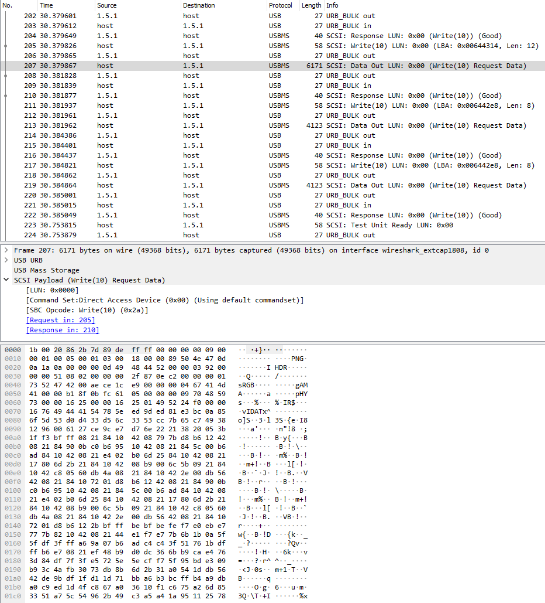
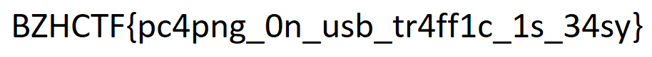

# [BreizhCTF2020 - Forensic] La livraison de pizza
    Value: 50

    Description:

    Un nouvel employé travaille tranquillement à son bureau, quand quelqu'un se présente devant pour 'Livraison de galettes saucisses'. Il est nouveau, mais il se dit qu'en Bretagne, après tout, cela doit arriver.

    Il est donc venu dans votre bureau vous demandez si vous aviez commandé, mais votre réponse est non. Il revient tout paniqué en vous disant que son anvitirus a enregistré un traffic USB inhabituel.

    L'anvitirus de votre entreprise est configuré pour prendre des dumps réseaux de tout le traffic, même le traffic USB ! A vous de l'analyser pour voir ce qu'il s'est passé.

    Auteur: Worty

    Format: BZHCTF{}

The provided file is a `.pcapng`, I decide to open it in wireshark.

I notice the packet #207 which contains the magic nomber of PNG files (`89 50 4e 47`):

I then take out of my pocket, my best friend, [CyberChef](https://gchq.github.io/CyberChef/#recipe=From_Hex('Auto')) with the contents of packet #207:

The problem is that the packet does not only contain the image but also a header that should be removed:

`'1b0020862b7d89deffff000000000900000100050001030018000089504e470d0a1a0a0000000d49' --> '89504e470d0a1a0a0000000d49'`

We then obtain an image with the flag in it:

