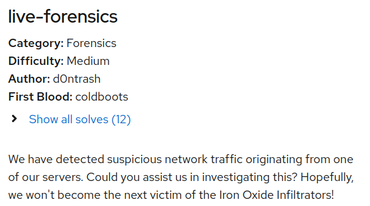
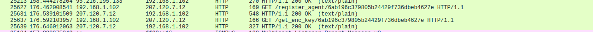
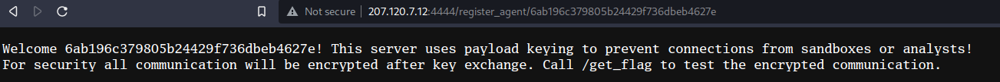
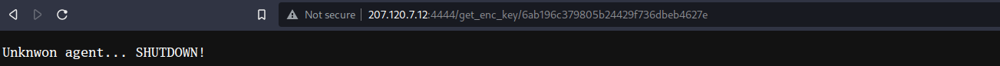
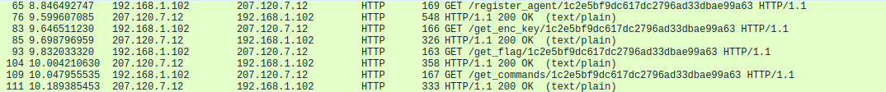
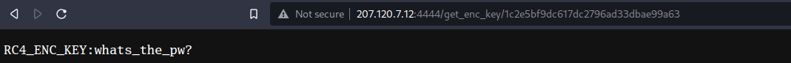
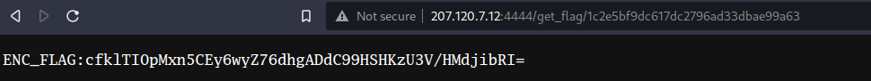
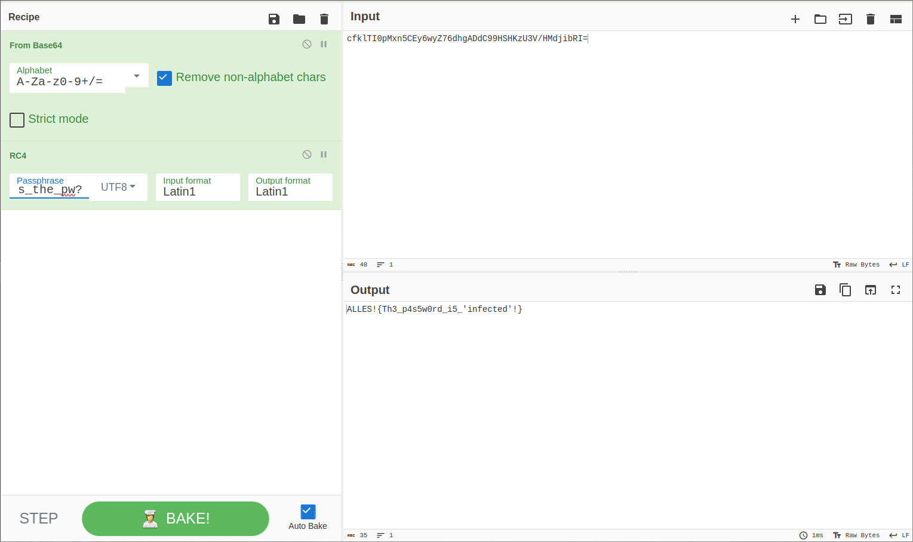

# CCCampCTF 2023 - Write-Up for the challenge live-forensics (Forensics)



**TL;DR:** Analysis of a dropper Linux malware.

**Description:** We have detected suspicious network traffic originating from one of our servers. Could you assist us in investigating this? Hopefully, we won't become the next victim of the Iron Oxide Infiltrators!

## Introduction

We are given SSH access, with root permissions, to a live machine.

When we connect to the machine, a binary `corrosion` located in home directory is ran as root.

```
[rlaspina@ARCH-RLS live_forensics] $ ssh -p 31222 e128435411528e7b20bafe14-live-forensics@challenge.master.camp.allesctf.net
=============
Forwarding to ctf@e128435411528e7b20bafe14-live-forensics
Good luck!
=============
To run a command as administrator (user "root"), use "sudo <command>".
See "man sudo_root" for details.

ctf@live-forensics-bfqqetfjre:~$ ls
corrosion
[1]+  Done                    sudo /home/ctf/corrosion
ctf@live-forensics-bfqqetfjre:~$
```

We then download the binary with `scp`. A quick analysis with VirusTotal gives nothing. Thus, we will briefly reverse it with Ghidra. It is written in Rust, so it will be a bit more painful.

## The Injector

It appears that the binary looks for a running `dropbear` process and for its libc mapping in memory. Then, the binary will drop a custom library `/tmp/libimplant.so` decrypted "on-the-fly". It will afterwards replace the libc in the memory of the `dropbear` process with the dropped library in order to inject malicious code.

```c
sysinfo::traits::SystemExt::new_all();
processes = sysinfo::traits::SystemExt::processes_by_exact_name(system,"dropbear",8);
process = <alloc::boxed::Box<I,A>as_core::iter::traits::iterator::Iterator>::next(processes);
process = core::option::Option<T>::expect(process,"Process not found!",0x12,&PTR_s_src/main.rs/libc.Cant_read_libc!_555556172bb8);
pid = <sysinfo::linux::process::Process_as_sysinfo::traits::ProcessExt>::pid(process);
pid = <sysinfo::common::Pid_as_sysinfo::common::PidExt>::as_u32(pid);
pid = <T_as_core::convert::TryInto<U>>::try_into(pid);
pid = core::result::Result<T,E>::unwrap(pid,extraout_EDX,&PTR_s_src/main.rs/libc.Cant_read_libc!_555556172bd0);
pid = nix::unistd::Pid::from_raw(pid);
local_1c = pid;
uVar1 = <T_as_core::convert::Into<U>>::into(pid);
get_libc_map(opt_libc_mapping,uVar1);
core::option::Option<T>::expect(libc_mapping,opt_libc_mapping, "libc map not found!",0x13,&PTR_s_src/main.rs/libc.Cant_read_libc!_555556172be8);
dlopen_offset = proc_maps::<impl_proc_maps::linux_maps::MapRange>::filename(libc_mapping);
dlopen_offset =
core::option::Option<T>::unwrap(dlopen_offset._0_8_,dlopen_offset._8_8_,&PTR_s_src/main.rs/libc.Cant_read_libc!_555556172c00);
dlopen_offset = std::path::Path::to_str(dlopen_offset._0_8_,dlopen_offset._8_8_);
dlopen_offset = core::option::Option<T>::unwrap(dlopen_offset._0_8_,dlopen_offset._8_8_,&PTR_s_src/main.rs/libc.Cant_read_libc!_555556172c18);
dlopen_offset = get_function_offset(dlopen_offset._0_8_,dlopen_offset._8_8_,"dlopen",6);
dlopen_offset2 = core::option::Option<T>::expect(dlopen_offset._0_8_,dlopen_offset._8_8_,"Function not found",0x12,&PTR_s_src/main.rs/libc.Cant_read_libc!_555556172c30);
local_18 = dlopen_offset2;
start_libc_mapping = proc_maps::<impl_proc_maps::linux_maps::MapRange>::start(libc_mapping);
if (CARRY8(start_libc_mapping,dlopen_offset2) == false) {
	local_10 = start_libc_mapping + dlopen_offset2;
	decrypt_payload(&DAT_5555556e760e,0xa2e820,&DAT_5555556e75fc,0x12,"unleash_your_power");
	str>::to_owned(str_libimplant,&DAT_5555556e75fc,0x12);
	<alloc::string::String_as_core::ops::arith::Add<&str>>::add(path_libc,str_libimplant,"",1);
    dlopen_offset = <alloc::string::String_as_core::ops::deref::Deref>::deref(path_libc);
    process = write_path_to_process(pid,dlopen_offset._0_8_,dlopen_offset._8_8_);
    local_8 = process;
    core::ptr::drop_in_place<alloc::string::String>(path_libc);
    inject(pid,start_libc_mapping + dlopen_offset2,process);
    core::ptr::drop_in_place<proc_maps::linux_maps::MapRange>(libc_mapping);
    core::ptr::drop_in_place<sysinfo::linux::system::System>(system);
    return;
}
```

With `gdb`, I directly jumped to `decrypt_payload` in order to dump the malicious library `libimplant.so`. We can next analyze this library in Ghidra. 

## The Injected

At a first glance, I didn't know where to search in this huge library. Therefore I searched for the string `flag`, and then I discovered a very strange function `call_home` which seems to do GET requests to a C2 server at IP `207.120.7.12` on port `4444`.

At this point, my idea was to
- run a local `dropbear` process,
- setup Wireshark in order to record the traffic generated by the malware,
- run the malware.
- get the flag in the capture

**And that's when I fell into the trap...** since the malware didn't look "very malicious", I was lazy and the end of the CTF was approaching, I didn't setup a VM and did these steps on my host.
**Readers, don't do that. Don't be lazy, setup a VM. Even in CTF...**

I missed a subtility: the malware do some requests with a hash in the URL, and the response of the C2 depends on the hash. Therefore, if the binary is ran from outside the live machine, the malware detects it and... shutdowns the computer... (:

## Flag

In the future runs, to avoid the shutdown, I renamed the `/bin/shutdown` binary so that the shutdown command fails. I restarted the steps above, and I got the following capture:



If we try to browse at these locations, we get the following:





It seems like there is an anti-sandbox protection: the C2 server check the hash in the URL, and don't give the flag/the decryption key for the flag if the hash is unknown. Additionally, if the response contains the word "SHUTDOWN", the binary shutdowns the machine.

Then, I investigated how was this hash computed and if it was possible to forge the good hash. 

```c
std::env::current_dir();
core::result::Result<T,E>::unwrap(local_ae0,local_ac8,&PTR_s_src/lib.rs/register_agent//get_e_002354a0);
auVar4 = <std::path::PathBuf_as_core::ops::deref::Deref>::deref(local_ae0);
auVar4 = std::path::Path::to_str(auVar4._0_8_,auVar4._8_8_);
auVar4 = core::option::Option<T>::unwrap(auVar4._0_8_,auVar4._8_8_,&PTR_s_src/lib.rs/register_agent//get_e_002354b8);
<D_as_digest::digest::Digest>::digest(local_af0,auVar4._0_8_,auVar4._8_8_);
```

Actually, this hash is obtained from the current working directory. Since the code is injected in the `dropbear` process, it is actually the working directory of `dropbear`.

```
ctf@live-forensics-imsxxqhzcj:~$ ps aux
USER         PID %CPU %MEM    VSZ   RSS TTY      STAT START   TIME COMMAND
root           1  0.0  0.0   2888  1040 ?        Ss   18:00   0:00 /bin/sh -c /opt/run.sh
root           7  0.0  0.0   4360  3172 ?        S    18:00   0:00 /bin/bash /opt/run.sh
root           8  0.0  0.0  79720  7252 ?        Sl   18:00   0:00 dropbear -FBREkp 1024
root           9  0.0  0.0   4792  2168 ?        D    18:00   0:00 dropbear -FBREkp 1024
ctf           10  0.5  0.0   4624  3744 pts/0    Ss   18:00   0:00 -bash
ctf           27  0.0  0.0   7060  1572 pts/0    R+   18:00   0:00 ps aux
ctf@live-forensics-imsxxqhzcj:~$ sudo cat /proc/8/environ
KUBERNETES_SERVICE_PORT_HTTPS=443KUBERNETES_SERVICE_PORT=443HOSTNAME=live-forensics-imsxxqhzcjPWD=/home/ctfHOME=/rootKUBERNETES_PORT_443_TCP=tcp://172.21.0.1:443SHLVL=1KUBERNETES_PORT_443_TCP_PROTO=tcpKUBERNETES_PORT_443_TCP_ADDR=172.21.0.1KUBERNETES_SERVICE_HOST=172.21.0.1KUBERNETES_PORT=tcp://172.21.0.1:443KUBERNETES_PORT_443_TCP_PORT=443PATH=/usr/local/sbin:/usr/local/bin:/usr/sbin:/usr/bin:/sbin:/bin_=/usr/sbin/dropbear
```

I found out that on the live machine, `dropbear` was ran from `/home/ctf`. Therefore, I created a `/home/ctf` directory locally, and repeated previous steps. And this time, the result is different!



If we browse to the accessed locations, we can this time retrieve a RC4 encryption key as well as the encrypted flag.





After decoding/decryption with CyberChef, we finally get the flag.



**FLAG:** `ALLES!{Th3_p4s5w0rd_i5_'infected'!}`

## Conclusion

A great thanks to the author, I had a lot of fun solving this chall.

*Dear reader, stay safe, use a VM...* :)
