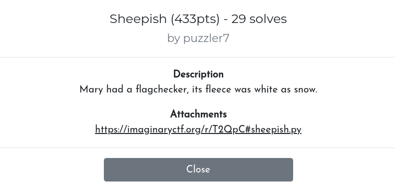

# imaginaryCTF 2023 - Write-Up for the challenge Sheepish (Reverse)



**TL;DR:** Obfuscated Python code using lambda-calculus.

**Description:** Mary had a flagchecker, its fleece was white as snow.

## Introduction

We are given a Python script, consisting in a single line of ~26k characters, with lots of lambda-functions. The full script is available [here](./src/sheepish.py)
, see the beginning and the end of the file below. 

```python
print((((lambda _____________:((lambda ___:_____________(lambda _______:___(___)(_______)))(lambda ___:_____________(lambda _______:___(___)(_______)))))(lambda _____________:lambda ___________:lambda ______:(lambda ____:(lambda _:_(lambda __________:lambda _____:__________))(____))(___________)(lambda _:(lambda __________:lambda _____:__________))(lambda _:(lambda __________:lambda _____:__________(_____)(lambda __________:lambda _____:_____))((lambda __________:lambda _____:(lambda __________:lambda _____:__________(_____)(lambda __________:lambda _____:_____))((lambda __________:lambda _____:(lambda __________:__________(lambda _:(lambda __________:lambda _____:_____))(lambda __________:lambda _____:__________))
[...]
(lambda _____________:(lambda ________:(((lambda ____:lambda ___:(lambda __________:lambda _____:lambda ______________:______________(__________)(_____))(lambda __________:lambda _____:_____)((lambda __________:lambda _____:lambda ______________:______________(__________)(_____))(___)(____)))(_____________(________[1:]))(((lambda _____________:((lambda ___:_____________(lambda _______:___(___)(_______)))(lambda ___:_____________(lambda _______:___(___)(_______)))))(lambda _____________:(lambda __:(((lambda __:lambda __________:lambda _____:__________(__(__________)(_____)))(_____________(__-1))) if __ else (lambda __________:lambda _____:_____)))))(________[0]))) if len(________) else ((lambda __________:lambda _____:lambda ______________:______________(__________)(_____))(lambda __________:lambda _____:__________)(lambda __________:lambda _____:__________))))))(input(">>> ").encode())))("Well done!")("Try again..."))
```

In order to make the code more "readable", we can replace the variable names (`_`, `__`, `___`, ...) with more readable names (`x1`, `x2`, `x3`, ...)

## A bit of culture

In theoretical science, it is known that [lambda-calculus](https://en.wikipedia.org/wiki/Lambda_calculus) is Turing-complete. In other words, any program can be simulated with "lambda-terms", namely, terms similar to `lambda` functions in Python.

For instance, the constant "true" can be simulated with the lambda-term λx.λy.x, and "false" with λx.λy.y. Integers can be represented as [Church numerals](https://en.wikipedia.org/wiki/Church_encoding).

The website <https://lambdacalc.io/> provides a good summary of "common lambda-terms" used to simulate common operations in programming.

## Deobfuscation, and solve

When looking closer at the code, we can observe such terms.

For instance, the constants true and false:
```python
tru = (lambda x10:lambda x5:x10)
fls = (lambda x10:lambda x5:x5)
```

as well as the Church numerals and their arithmetic operations:
```python
power = (lambda x10:lambda x5:x5(x10))
is0 = (lambda x10:x10(lambda x01:(fls))(tru))
succ = (lambda x2:lambda x10:lambda x5:x10(x2(x10)(x5)))
pred = (lambda x2:lambda x13:lambda x3:x2(lambda x12:lambda x9:x9(x12(x13)))(lambda x01:x3)(lambda x10:x10))
plus = (lambda x10:lambda x5:x10(succ)(x5))
minus = (lambda x10:lambda x5:x5(pred)(x10))
le = (lambda x10:lambda x5:is0(minus(x10)(x5)))
ge = (lambda x10:lambda x5:is0(minus(x5)(x10)))
mult = (lambda x10:lambda x5:lambda x14:x10(x5(x14)))
two = (lambda x10:lambda x5:x10(x10(x5)))
three = (lambda x10:lambda x5:x10(x10(x10(x5))))
four = (succ)(three)
```

The script is now way shorter, and a bit understandable (see [here](./src/sheepish_deobf2.py)). We can recognize a sequence of arithmetic expressions, such as:

```
((plus)(mult((power)(two)(four))(succ(mult(two)(three))))((plus)(mult(two)(three))(succ(mult(two)(three)))))
```

The characters of the flag, maybe?

To solve the chall, I took the expressions, and I reimplemented the operators (full script [here](./src/sheepish_arith.py)):

```python
def plus(x):
    return lambda y: x + y

def mult(x):
    return lambda y: x * y

def power(x):
    return lambda y: x ** y

def succ(x):
    return x+1

zero = 0
two = 2
three = 3
four = 4

flag = ""

flag += chr(((plus)(mult((power)(two)(four))(succ(mult(two)(three))))((plus)(mult(two)(three))(succ(mult(two)(three))))))
flag += chr(((plus)(mult((power)(two)(four))(three))(mult((plus)(two)(three))(three))))
[...]
flag += chr(((plus)(mult((power)(two)(four))(mult(two)(three)))(three)))
flag += chr(((plus)(mult((power)(two)(four))(mult(two)(three)))((power)(three)(two))))

print(flag[::-1])
```

**FLAG:** ictf{d0_sh33p_b@@@?}

## Upsolve

Even if identifying the arithmetic expressions was enough to solve the challenge, I was curious to understand the rest of the script.

In particular, the first lambda-term is very strange: 
```python
(lambda x13:((lambda x3:x13(lambda x7:x3(x3)(x7)))(lambda x3:x13(lambda x7:x3(x3)(x7)))))
```

`x3` is applied to itself!

This term is a fixed-point combinator, more precisely a Z combinator: see theoretical details [here](https://en.wikipedia.org/wiki/Fixed-point_combinator). Roughly, it's a term that can be used to simulate recursion.

Moreover, a long sequence of "chained" pairs appears at the beginning:
```python
((lambda x4:lambda x3:pair(fls)(pair(x3)(x4)))((lambda x4:lambda x3:pair(fls)(pair(x3)(x4)))((lambda x4:lambda x3:pair(fls)(pair(x3)(x4)))((lambda x4:lambda x3:pair(fls)(pair(x3)(x4)))((lambda x4:lambda x3:pair(fls)(pair(x3)(x4))) ((lambda x4:lambda x3:pair(fls)(pair(x3)(x4))) ((lambda x4:lambda x3:pair(fls)(pair(x3)(x4)))((lambda x4:lambda x3:pair(fls)(pair(x3)(x4)))((lambda x4:lambda x3:pair(fls)(pair(x3)(x4))) ((lambda x4:lambda x3:pair(fls)(pair(x3)(x4)))((lambda x4:lambda x3:pair(fls)(pair(x3)(x4)))((lambda x4:lambda x3:pair(fls)(pair(x3)(x4)))((lambda x4:lambda x3:pair(fls)(pair(x3)(x4)))((lambda x4:lambda x3:pair(fls)(pair(x3)(x4)))((lambda x4:lambda x3:pair(fls)(pair(x3)(x4)))((lambda x4:lambda x3:pair(fls)(pair(x3)(x4)))((lambda x4:lambda x3:pair(fls)(pair(x3)(x4)))((lambda x4:lambda x3:pair(fls)(pair(x3)(x4)))((lambda x4:lambda x3:pair(fls)(pair(x3)(x4))) ((lambda x4:lambda x3:pair(fls)(pair(x3)(x4))) (pair(tru)(tru)) [...]) [...]) [...])
```

This term actually represents a linked list, whose elements are the susmentionned arithmetic expressions.

After further deobfuscation/understanding, we can conclude that the script performs successive comparisons on the chars of the input, in reverse order, with the chars in the linked list.

## Conclusion

As a functional programming lover, I enjoyed a lot solving this chall. A big thanks to the author!
I know it was possible to side-channel it, but it was funnier with lambda-calculus :)
